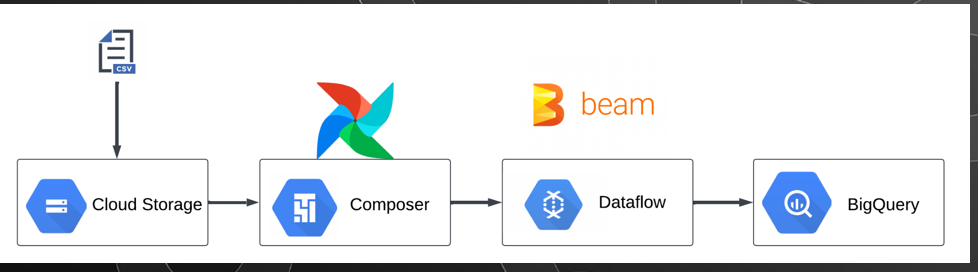

# GCP Project Listing & Uber DE Project Summary

## 1. Viewing All Projects in Google Cloud Platform (GCP)

### Note
- ingestion:
  cloud run-- run app in a container; custom api injection scenarios; event driven architecture;nonstandard ingestions
  *cloud pub/sub--ingest real-time data, parallel process/workflow, db replication

- transformation:
  dataproc-- apache spark etc, scalable for batch and ML processing
  dataflow-- batch and stream processing; apache beam;

- storage:
  cloud sql-- rdbms; app backend;analytics & reporting; transactional workloads; temp storage layer(etl)
  cloud storage-- structured &unstructured data; used as data lake;bkup&disaster covery; ML & Bigdata procesng; 

- Orchestration:
  automation and management of data (etl etc)
  cloud composer-- workflow based on airflow and dags; multi cloud/hybrid; 
  cloud scheduler-- cron/task scheduler managed job scheduler ; trigger tasks in etl pipeline

- ETL:
  cloud data fusion-- CDAP (cast data application program)


### 1.1 Using the GCP Console
1. Go to [Google Cloud Console Projects Page](https://console.cloud.google.com/cloud-resource-manager).
2. View the list of **all projects** you have permissions for.
3. Filter by **project name, ID, or number**.
4. If a project is missing:
   - Check you are logged in with the correct account.
   - Verify you have at least `roles/viewer` access.

---

### 1.2 Using gcloud CLI
Run:
```bash
gcloud projects list --filter="name:dedwhetl"
```

### 1.3 Using the Resource Manager API
```bash
curl -H "Authorization: Bearer $(gcloud auth print-access-token)" "https://cloudresourcemanager.googleapis.com/v1/projects"
```

---
# Uber DE Capstone on GCP (Project: dedwhetl)

## 2.Project Summary
Legacy partners drop daily trip CSVs into Google Drive. Manual handling slows analytics and causes payout errors. We’ll build an automated, governed pipeline on GCP that ingests files, validates and transforms data, loads a star schema in BigQuery, and powers dashboards & ML‑ready datasets.
---

### 2.1 Business KPIs
- Daily rides & revenue by city/vehicle
- Cancellation rate (customer vs driver)
- Avg rating, distance, fare per km
- SLA: daily refresh 02:00 (upgradeable to hourly)

---

### 2.2 Rationale
1. **Revenue Loss Prevention** – Real-time pipeline → 5-10% boost.
2. **Technical Debt Crisis** – Automated ETL (Spark/Delta Lake) → 40% cost reduction.
3. **Growth Readiness** – Siloed data blocks expansion into Uber Eats/Freight  → Unified lakehouse → 2× faster market launches.
---

### 2.3 Objectives
- Build scalable cloud data pipelines (Ingest, clean, and transform large-scale CSV data into analytics-ready formats (Delta Lake,Parquet) & Implement batch & incremental (CDC) processing to optimize costs.)
- Implement modern lakehouse-to-warehouse architecture ((S3 → Spark → Snowflake/BigQuery), Apply partitioning, indexing, and compaction for performance.)
- Ensure data reliability with validation and monitoring (schema checks, anomaly detection, Implement monitoring & alerting (Airflow/Databricks Jobs)
- Deliver timely data for pricing, fraud detection, driver incentives.(e.g., reduce storage spend by 30%).

---

### 2.4 Data Description
| Column Name | Description |
|-------------|-------------|
| Date | Booking date |
| Time | Booking time |
| Booking ID | Unique ride ID |
| Booking Status | Completed/Cancelled status |
| Customer ID | Unique identifier for customers |
| Vehicle Type | Type of vehicle used |
| Pickup Location | Ride starting location |
| Drop Location | Ride destination location |
| Avg VTAT | Average Vehicle Time at Arrival |
| Avg CTAT | Average Customer Time at Arrival |
| Cancelled Rides by Customer | Flag for customer-initiated cancellations |
| Reason for cancelling by Customer | Reason provided by customer |
| Cancelled Rides by Driver | Flag for driver-initiated cancellations |
| Driver Cancellation Reason | Reason provided by driver |
| Incomplete Rides | Flag for incomplete rides |
| Incomplete Rides Reason | Reason for incomplete rides |
| Booking Value | Total fare amount |
| Ride Distance | Distance traveled in km |
| Driver Ratings | Driver rating (1-5) |
| Customer Rating | Customer rating (1-5) |
| Payment Method | UPI, Cash, Credit Card, etc. |

---
### 2.5 Tech Stack
- **Cloud**:  GCP 
- **Tools**: Apache Beam, Airflow,Python, github
- **GCP Service**: Cloud Composer, Cloud Storage(GCS), BigQuery, Dataflow
- **Concepts**: CDC, star schema, PII governance, cloud optimization

---

### 2.6 Workflow
1. Data source (CSV in Drive) (https://drive.google.com/drive/folders/1f3PkGyG4lSNUJdb6z26I3YMVvKQAYMtu) → 
2. Data ingestion from Drive →  Google Cloud Storage(GCS).
3. Data transformation(cleaning, standardization, star schema) with Apache Beam and Dataflow.
4. Data pipeline orchestration using Cloud Composer.
5. Data Storage and Analytics using BigQuery.
6. Observability (DQ checks, logging, alerts)
7. Consumption (Looker Studio dashboards; optional ML with Vertex AI)

### 2.7 Target Architecture (GCP)
Google Drive
  └─(Option A: BigQuery External Table on Drive)
  └─(Option B: Storage Transfer Service → GCS raw/)
                     ↓
            Transform (curated star schema: dims + facts) → BigQuery
                     ↓
    Data Catalog / Monitoring / Alerts / Access Control
                     ↓
        Looker Studio Dashboards

Recommendation for capstone:
- Fast path (Option A): Create a BigQuery external table on Drive for immediate ingest; then scheduled queries load/transform into curated tables.

- Production path (Option B): Use Storage Transfer Service (STS) from Drive → GCS (raw), then load to BigQuery.




## 3 One‑Time Setup
### 3.1 Enable required APIs (one time):
gcloud config set project dedwhetl
gcloud services enable \
  bigquery.googleapis.com \
  storage.googleapis.com \
  storagetransfer.googleapis.com \
  drive.googleapis.com \
  datacatalog.googleapis.com \
  monitoring.googleapis.com \
  logging.googleapis.com \
  dataflow.googleapis.com\
  composer.googleapis.com\
  bigquery.trnsferapi

A. create credentials for compose and grant roles:
      cloud composer servive account v1 & v2
      bigquery admin
      dataflow developer
      composer worker
B. Install Apache beam in cloud shell
  pip install apache-beam
  add to path (echo 'export PATH="$PATH:/home/bthonia/.local/bin"' >> ~/.bashrc
              source ~/.bashrc)
              check to ensure its been written to path: echo $PATH | tr ':' '\n' | grep bthonia
C. create buckets
  Make a dataset for raw data ( BigQuery External Table over Drive (fastest to demo))===
  bq --location=europe-west2 mk --dataset dedwhetl:uber_raw
  Make a dataset for cleaned/star schema tables===
  bq --location=europe-west2 mk --dataset dedwhetl:uber_curated

D. create a composer environment and a DAGs folder 
  airflow v2; standard resilience


## Step 2 – Ingestion (Drive → GCS/BigQuery)
Option A — BigQuery External Table on Drive -- In BigQuery console
- Create an external table that reads directly from Drive in the uber_raw folder:  
        `dedwhetl.uber_raw.uber_ncr_ride_bookings` 
--in SDK
CREATE OR REPLACE EXTERNAL TABLE `dedwhetl.uber_raw.uber_ncr_ride_bookings`
OPTIONS (
  format = 'CSV',
  uris = ['https://docs.google.com/spreadsheets/d/1y54-d0V5xyWzJIy9RWWro52cndmuzztwg0wyCidGtY0/edit?gid=543099386#gid=543099386'],
  skip_leading_rows = 1,
  autodetect = TRUE,
  allow_quoted_newlines = TRUE
);--
- Query / move to data transformation


Option B -  Storage Transfer Service (Drive → GCS), then BigQuery (production‑ready)
- Create the target GCS bucket : 
    gsutil mb -l europe-west2 -b on gs://uber-raw
    gsutil mb -l europe-west2 -b on gs://uber-transformed  (for cleaned + star schema)

- in Storage Transfer Service console, create transfer from google drive to the created buckets
  dedwhetl, the STS service account is: [846486827190@storage-transfer-service.iam.gserviceaccount.com]
  download file to bucket 
    gsutil cp ~/Downloads/rawuber_2025-01-01.csv gs://uber-raw-dedwhetl/trips/
